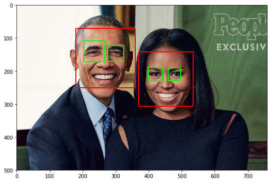
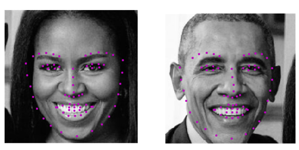

# Facial Keypoint Detection

## Project Overview

This repository contains project files for Computer Vision, Nanodegree  via [Udacity](https://eu.udacity.com/course/computer-vision-nanodegree--nd891). It combine knowledge of Computer Vision Techniques and Deep learning Architectures to build a facial keypoint detection system that takes in any image with faces, and predicts the location of 68 distinguishing keypoints on each face. Facial keypoints include points around the eyes, nose, and mouth on a face and are used in many applications (facial tracking, facial pose recognition, facial filters, and emotion recognition).

## Examples
+ **Detect all faces using Haar Cascade Classifiers using OpenCV**
<p align="center">  </p> 

+ **Detect facial keypoint with a Convolutional Neural Network**
<p align="center">  </p>

## Project Structure
The project will be broken up into a few main parts in four Python notebooks:
#### `models.py`
__Notebook 1__ : Loading and Visualizing the Facial Keypoint Data

__Notebook 2__ : Defining and Training a Convolutional Neural Network (CNN) to Predict Facial Keypoints

__Notebook 3__ : Facial Keypoint Detection Using Haar Cascades and your Trained CNN

__Notebook 4__ : Fun Filters and Keypoint Uses

### Local Environment Instructions

1. Clone the repository, and navigate to the downloaded folder. This may take a minute or two to clone due to the included image data.
	```
	git clone https://github.com/nalbert9/Facial-Keypoint-Detection.git
	```
2. Create (and activate) a new Anaconda environment (Python 3.6).
Download via [Anaconda](https://www.anaconda.com/distribution/)

	- __Linux__ or __Mac__: 
	```
	conda create -n cv-nd python=3.6
	source activate cv-nd
	```
	- __Windows__: 
	```
	conda create --name cv-nd python=3.6
	activate cv-nd
	```

3. Install PyTorch and torchvision; this should install the latest version of PyTorch;
```
conda install pytorch torchvision cudatoolkit=9.0 -c pytorch
```
6. Install a few required pip packages, which are specified in the requirements text file (including OpenCV).
```
pip install -r requirements.txt
```

## Licence
This project is licensed under the terms of the [](https://opensource.org/licenses/MIT)
